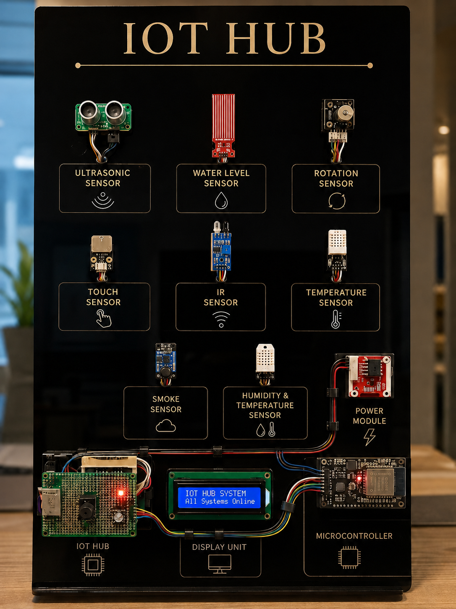
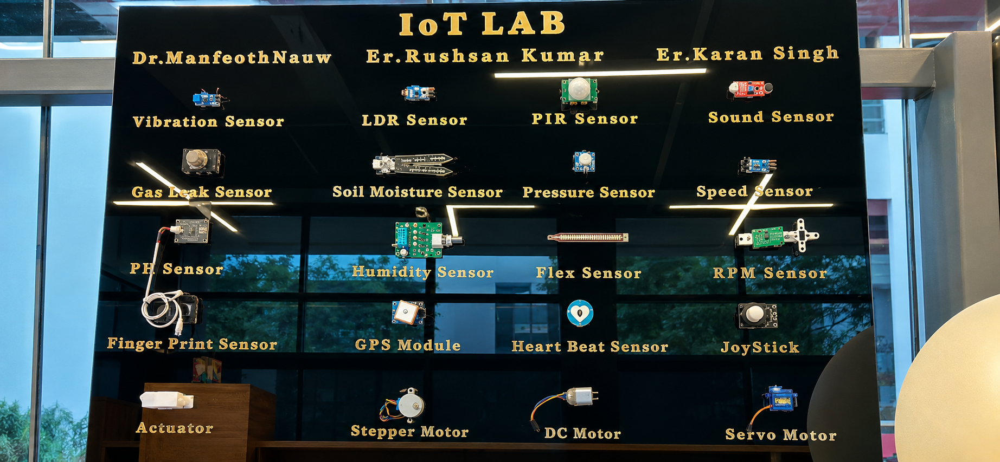

<div align="center">

# ⚡ IoT Hub

### An All-in-One ESP32 Based Multi-Sensor Development Platform

**Build • Learn • Prototype • Innovate**



<br>


</div>

---

# 📖 Overview

IoT Hub is an ESP32-based multi-sensor development platform designed to simplify IoT prototyping. It combines multiple sensors, communication modules, and output devices on a single custom PCB, reducing wiring complexity and enabling rapid development of smart applications.

The platform is ideal for students, educators, researchers, and IoT developers who want an all-in-one solution for building and testing embedded system projects.

---

# 📑 Table of Contents

- [Project Gallery](#-project-gallery)
- [Features](#-features)
- [Hardware Components](#-hardware-components)
- [Hardware Specifications](#-hardware-specifications)
- [Repository Structure](#-repository-structure)
- [Getting Started](#-getting-started)
- [Applications](#-applications)
- [Future Scope](#-future-scope)
- [Contributing](#-contributing)
- [Authors](#-authors)
- [License](#-license)

---

# 📸 Project Gallery

## IoT Hub Development Board


---

## IoT Lab Setup



---

# ✨ Features

- ESP32-based Development Board
- Custom Designed PCB
- Wi-Fi & Bluetooth Connectivity
- Multiple Onboard Sensors
- Real-Time Data Monitoring
- LCD Display Support
- Buzzer & Relay Control
- Plug-and-Play Design
- Arduino IDE Compatible
- Easy Expansion for Future Modules

---

# 🧩 Hardware Components

## 🔹 Controller

- ESP32 Development Board

## 🔹 Sensors

- Ultrasonic Sensor
- Water Level Sensor
- Rotary Encoder
- Touch Sensor
- IR Sensor
- Temperature Sensor
- Humidity Sensor
- Smoke Sensor
- Gas Leak Sensor
- LDR Sensor
- PIR Sensor
- Soil Moisture Sensor
- Sound Sensor
- Vibration Sensor
- Pressure Sensor
- Speed Sensor
- Flex Sensor
- pH Sensor
- GPS Module
- Heart Beat Sensor
- Fingerprint Sensor
- Joystick

## 🔹 Actuators

- Servo Motor
- Stepper Motor
- DC Motor

## 🔹 Display

- 16×2 LCD Display

## 🔹 Communication

- Wi-Fi
- Bluetooth

## 🔹 Power

- Dedicated Power Module

---

# 📋 Hardware Specifications

| Specification | Details |
|--------------|---------|
| Microcontroller | ESP32 |
| PCB Type | Custom Designed |
| Connectivity | Wi-Fi & Bluetooth |
| Programming | Arduino IDE |
| Display | 16×2 LCD |
| Communication Protocols | UART, SPI, I2C |
| Power Supply | 5V DC |

---

# 📁 Repository Structure

```text
IoT-Hub/
│
├── README.md
├── docs/
├── hardware/
└── images/
```

---

# 🚀 Getting Started

## Clone the Repository

```bash
git clone https://github.com/YOUR_USERNAME/IoT-Hub.git
```

> Replace **YOUR_USERNAME** with your GitHub username after creating the repository.

---

## Software Requirements

- Arduino IDE
- ESP32 Board Package
- Required Arduino Libraries

---

## Upload the Firmware

1. Connect the ESP32 board.
2. Open the project in Arduino IDE.
3. Install the required libraries.
4. Select **ESP32 Dev Module**.
5. Select the correct COM Port.
6. Click **Upload**.

---

# 📊 Applications

- Smart Home Automation
- Smart Agriculture
- Industrial IoT
- Weather Monitoring
- Environmental Monitoring
- Educational Projects
- Research & Development
- Embedded Systems Learning

---

# 🔮 Future Scope

- Mobile Application Support
- MQTT Communication
- OTA Firmware Updates
- Cloud Dashboard
- AI-Based Analytics
- Voice Assistant Integration

---

# 🤝 Contributing

Suggestions, feedback, and improvements are always welcome.

---

# 👨‍💻 Author

**Mohit Yadav**

---

# 📜 License

This project is intended for educational and academic purposes.

---

<div align="center">

## ⭐ If you found this project useful, please consider giving it a star.

**Made with ❤️ using ESP32**

</div>
